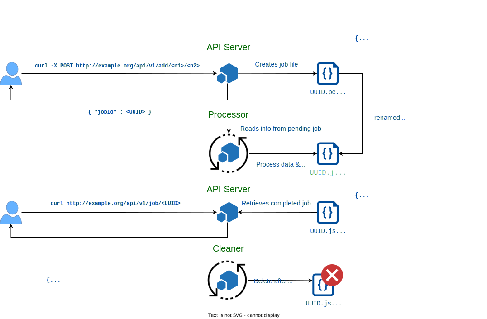

# go-queue



> Los ejemplos se muestran usando [`httpie`](https://httpie.io/cli), aunque también se muestra el comando `curl` equivalente.

## Crear una tarea

```bash
$ # curl -X POST http://127.0.0.1:8080/api/v1/add/11/22
$ http POST 127.0.0.1:8080/api/v1/add/11/22
HTTP/1.1 202 Accepted
Content-Length: 46
Content-Type: application/json; charset=utf-8
Date: Tue, 30 Aug 2022 19:21:49 GMT

{
    "job": "696ccc1b-22d4-4d1c-ada6-7266808d3edd"
}
```

## Obtener el resultado de la tarea

```bash
$ # curl http://127.0.0.1:8080/api/v1/job/696ccc1b-22d4-4d1c-ada6-7266808d3edd
$ http 127.0.0.1:8080/api/v1/job/696ccc1b-22d4-4d1c-ada6-7266808d3edd
HTTP/1.1 200 OK
Content-Length: 171
Content-Type: application/json; charset=utf-8
Date: Tue, 30 Aug 2022 19:22:20 GMT

{
    "created": "2022-08-30T21:21:49.97545611+02:00",
    "id": "696ccc1b-22d4-4d1c-ada6-7266808d3edd",
    "num1": 11,
    "num2": 22,
    "result": 33,
    "updated": "2022-08-30T21:21:51.83920368+02:00"
}
```

### Error si la tarea no ha sido completada

Si `processor` no ha tenido tiempo para procesar el fichero o si ha ocurrido algún error, el fichero correspondiente al `uuid` identificador del *job* sigue en estado `.pending`.

Al intentar recuperar el resultado del *job* se busca un fichero `.json`, por lo que se recibe el error:

```bash
$ # curl http://127.0.0.1:8080/api/v1/job/1c164537-fb3b-48d4-877e-964e90820099 
$ http 127.0.0.1:8080/api/v1/job/1c164537-fb3b-48d4-877e-964e90820099
HTTP/1.1 500 Internal Server Error
Content-Length: 30
Content-Type: application/json; charset=utf-8
Date: Tue, 30 Aug 2022 19:26:41 GMT

{
    "message": "unexpected error"
}
```